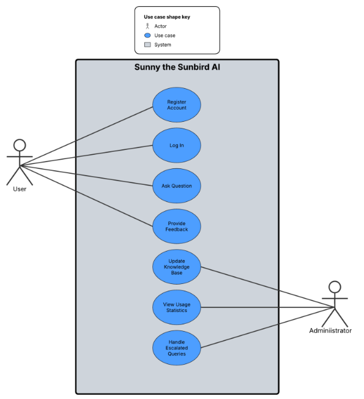
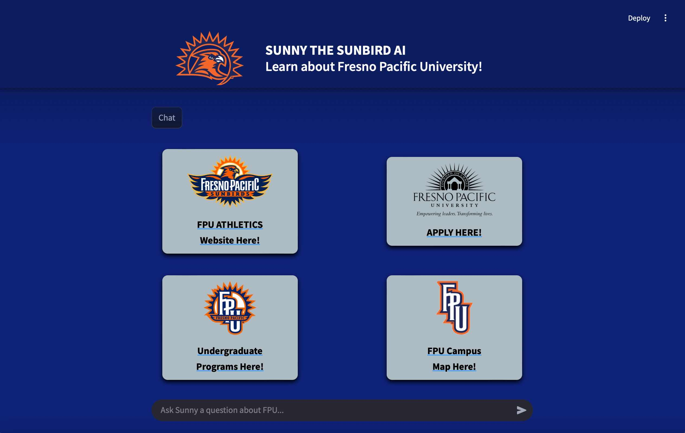
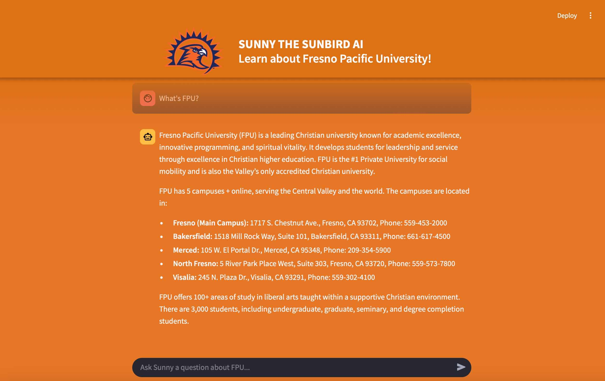

# ChatBot using Gemini API and streamlit

 ## Team Formation/Role Assignments
 | Team Member | Role |
---|---
| Martin Ramirez | AI Integration Developer |
| Angel Espana del Rio | Frontend Developer |
| Elmer Carballo | Backend Developer |
| Daniel Mota | Documentation Expert |

## 1. Introduction
>Sunny The Sunbird AI is an AI model designed to assist those who may have questions about things regarding Fresno Pacific University.

### 1.1 Purpose 
>This document details the functions and certain design elements of the AI model/site.

### 1.2 Intended Audience and Reading Suggestions
>This document is primarily intended to explain the requirements, value, and functionality of Sunny The Sunbird AI for those who may be reviewing the project.

### 1.3 Product Scope
>Sunny the Sunbird is an AI model intended to answer questions that students, professors, or even visitors may have, as well as offering assistance where it is needed.

## 2. Overall Description

### 2.1 Product Perspective
>This ChatBot is a conversational bot designed to address various questions about Fresno Pacific University. It automatically processes information from a provided PDF file and leverages the Gemini API for processing techniques and responds to user inquiries effectively.
### 2.2 Product Functions
>Major functions include: Information processing, Usage Statistics

### 2.3 User Classes and Characteristics
>Student Persona: Fresno Pacific University student needing efficient support for university-related tasks. 
>- Needs quick answers to FAQs, redirection to official resources, and university-related event updates.

>Professor Persona: Fresno Pacific University faculty member seeking information to support teaching and student guidance. 
>- Needs access to academic policies, departmental contact details, and updates on university events relevant to faculty responsibilities.

>Visitor Persona: An individual exploring Fresno Pacific University’s campus or services, such as prospective students, parents, or event attendees. 
>- Needs general information about campus facilities (e.g., athletic complexes, parking), directions, and public event schedules. 

>Administrator Persona: Fresno Pacific University staff managing student inquiries. 
>- Needs reduced workload through automation and insights into common student questions.

### 2.4 Operating Environment
>Google Gemini was used as a base for the AI model, and a PDF containing information is what the AI draws from to answer the user.

### 2.5 Design and Implementation Constraints
>Sunny the Sunbird will be implemented as a website that hosts the AI model, though as of now is currently seperated from Fresno Pacific University's online resources, so even if these resources were to malfunction for whatever reason, the site would still work.

### 2.6 User Documentation
>The user is prompted to ask questions about Fresno Pacific University to the AI model, though what they ask is up to them, the AI will likely not respond to unrelated questions properly.

### 2.7 Assumptions and Dependencies
>It is assumed that
>* The user types questions related to Fresno Pacific University and its services
>* Google Gemini remains operational

## 3. External Interface Requirements

### 3.1 User Interfaces

> * **Splash Page**

> * **AI Response**

### 3.2 Hardware Interfaces
>The project is hosted on Google Cloud, and utilizes the Gemini API

### 3.3 Software Interfaces
>Our software works by communicating with Google's Gemini API that is in charge of printing answers. Its main function is to generate responses to whatever query the user submits.

### 3.4 Communications Interfaces
>An internet connection, web browser, and access to Google Cloud, are needed to utilize Sunny The Sunbird AI.

## 4. System Features

### 4.1 Splash Page
#### 4.1.1 Description
>This is the first thing the user sees upon entering the site. As well as the chatbot being readily available, it also includes links to the FPU athletics website, FPU applications, undergraduate programs, and a map of the campus.

#### 4.1.2 Stimulus/Response Sequences
>If the user clicks one of the links mentioned before, then it will take them to their respective sites. If the user types something on the textbox and presses enter, then the AI will respond to the student in whichever way it can.

#### 4.1.3 Functional Requirements
>See sections 2.5, 2.7, and 3.4.

### 4.2 AI Response

#### 4.2.1 Description
>This shows up when the user types something for the AI to respond to, making the links from before disappear.

#### 4.2.2 Stimulus/Response Sequences
>The user is prompted to type questions for the AI to respond to, and shows previous questions/answers if the user scrolls up.

#### 4.2.3 Functional Requirements
> See sections 2.5, 2.7, and 3.4.

## 5. Other Nonfunctional Requirements

### 5.1 Software Quality Attributes
### 5.1.1 Ease of Use
>It is imperative that the website be intuitive and simple to use, as the primary objective is to streamline the process of giving the user whatever answer they need.

### 5.1.2 Accuracy and Availability
>Ensuring the website delivers the most up to date results as well as only accurate results is of the upmost priority. The website should never display inaccurate information and should be available for reuse each semester.
